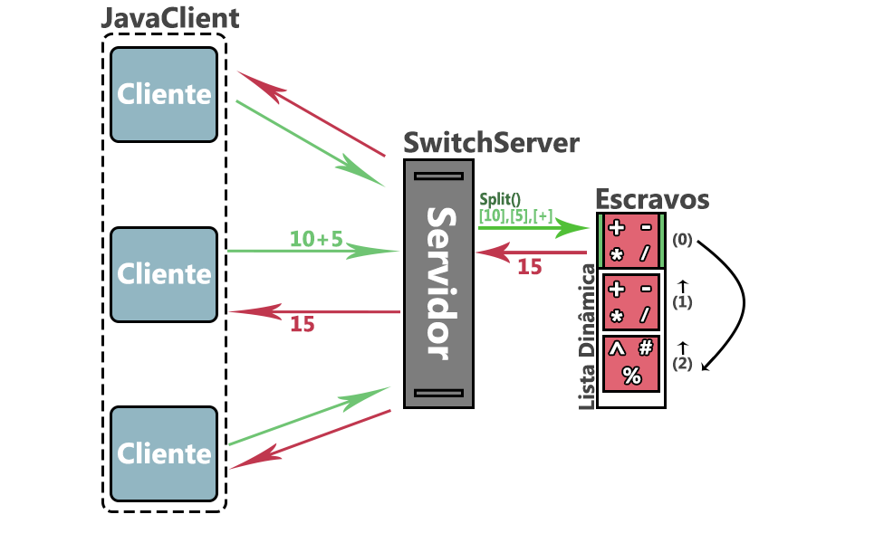

# Sist-Distribuidos

Pequeno sistema distribuído de servidores utilizando sockets.

## Diagrama

## Decisões de projeto
Utilizou-se Sockets para conexão e Threads para comportar vários clientes no mesmo servidor.

Dependendo da mensagem o servidor (SwitchServer) encaminha o pedido ao servidor escravo neccessário por meio do uso da função split() nas strings do Java.

As portas foram escolhidas com enfase na memorização, com cuidado para evitar portas <= 1024. Os escravos receberam portas sequenciais.

Lista de portas: 
  * SimpleJavaClient [6666]
  * SwitchServer 	 [6666]
  * ServerAdd	[1234]
  * ServerSub 	[1235]
  * ServerMult 	[1236]
  * ServerDiv 	[1237]
  * ServerPot 	[1238]
  * ServerPorc 	[1239]
  * ServerSqr 	[1240]
